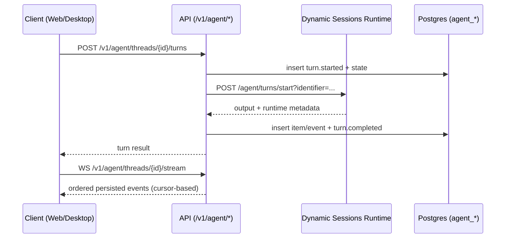
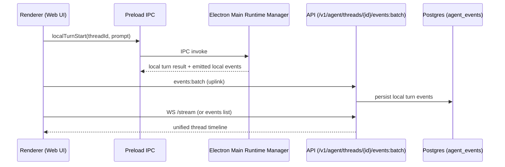
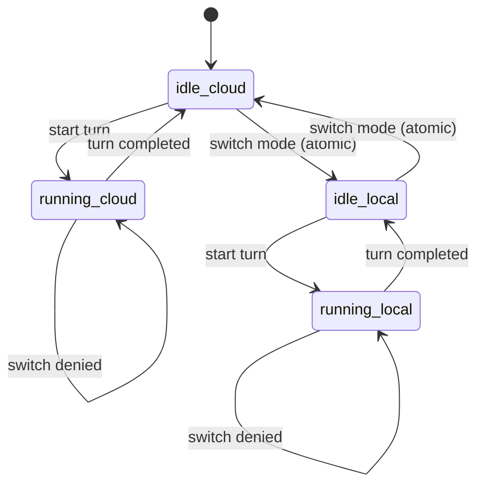

# Dual-Mode Agent Runtime Baseline

## Scope

This document defines groundwork for one thread model with two execution modes:

1. `cloud`: API-brokered execution through Azure Dynamic Sessions runtime.
2. `local`: desktop-brokered execution through Electron main-process runtime manager.

This phase provides thin end-to-end behavior in both modes and keeps product API/auth surfaces stable.

## Canonical Terms

1. `agent thread`: tenant-scoped conversation identity.
2. `execution_mode`: `cloud | local`.
3. `execution_host`: `dynamic_sessions | desktop_local`.
4. `turn event`: immutable runtime event persisted in `agent_events`.
5. `approval`: explicit user decision gate attached to a turn/item.

## Persistence Baseline

1. Runtime tables are renamed from `codex_*` to `agent_*`.
2. `agent_threads` stores current execution mode/host and optional `cloud_session_identifier`.
3. `agent_turns` stores per-turn execution snapshots and runtime metadata.
4. `agent_events` is the shared event timeline for cloud and local turns.
5. Tenant membership remains the authorization boundary in all read/write paths.

## Cloud Flow (API-Brokered)

## Local Flow (Desktop-Brokered)

## Mode Switch State Machine

Rules:

1. Switch is allowed only when no turn is `inProgress`.
2. Switch is persisted atomically and audited via `thread.modeSwitched` event.
3. Same `threadId` is retained across mode changes.

## Security Model

1. Browser clients never receive Dynamic Sessions management tokens.
2. Browser clients never receive raw session identifier policy logic.
3. Local credentials are stored only through Electron `safeStorage` (OS-backed encryption) in main process.
4. Renderer never talks directly to local runtime process; preload IPC is the only bridge.
5. Tenant authorization is enforced for HTTP routes and websocket stream subscriptions.

## Feature Flags

1. `AGENT_GATEWAY_ENABLED`
2. `AGENT_CLOUD_MODE_ENABLED`
3. `AGENT_LOCAL_MODE_ENABLED_DESKTOP`
4. `AGENT_MODE_SWITCH_ENABLED`

## Current Groundwork Coverage

1. Agent HTTP API and websocket stream endpoint are live behind flags.
2. Dynamic Sessions runtime wrapper supports bootstrap/start/interrupt endpoints with deterministic mock engine.
3. Desktop runtime manager supports local login state, local turn execution, and event emission through IPC.
4. Web chat route supports `cloud` and `local` mode selection with same-thread continuity.
5. Local mode uplinks events to `/v1/agent/threads/{threadId}/events:batch`.

## Deferred

1. Full Codex App Server protocol mapping over stdio.
2. Rich multi-item streaming payload rendering in web UI.
3. Production mode default policy and tenant-level rollout controls.
