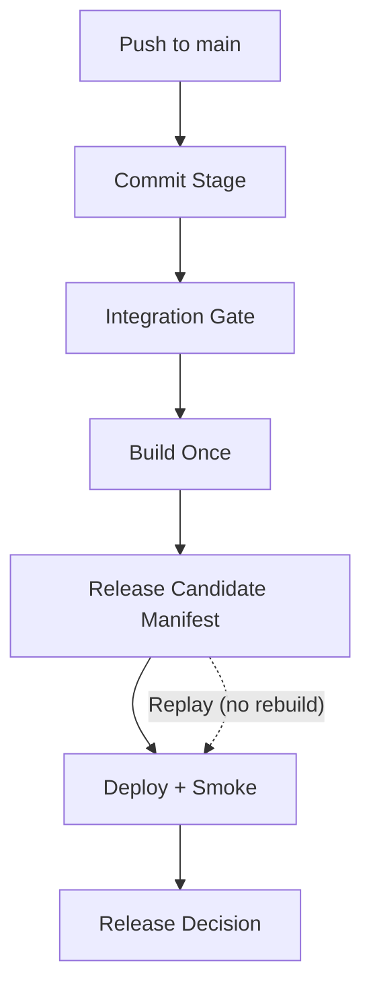

# Development Pipeline (Trunk-Based CD)

Purpose: keep `main` releasable through deterministic quality gates and immutable promotion.

## Core Idea

- Every push to `main` must pass `commit-stage` and `integration-gate`.
- Build once and publish one immutable release candidate manifest.
- Deploy and verify that same release candidate.
- Record a final release decision.
- If `main` goes red, fix forward or revert immediately.

## Flow

## Terms

- `trunk`: `main`
- `quality gate`: required status contexts
- `release candidate`: `.artifacts/release-candidate/<sha>/manifest.json`
- `replay`: redeploy existing release candidate SHA without rebuild

## Evidence

- `.artifacts/commit-stage/<sha>/result.json`
- `.artifacts/integration-gate/<sha>/result.json`
- `.artifacts/release-candidate/<sha>/manifest.json`
- `.artifacts/infra/<sha>/deployment.json`
- `.artifacts/deploy/<sha>/api-smoke.json`
- `.artifacts/release/<sha>/decision.json`

## Source Of Truth

- `.github/policy/pipeline-policy.json`
- `.github/workflows/commit-stage.yml`
- `.github/workflows/integration-gate.yml`
- `.github/workflows/cloud-deployment-pipeline.yml`
- `.github/workflows/cloud-deployment-pipeline-replay.yml`
