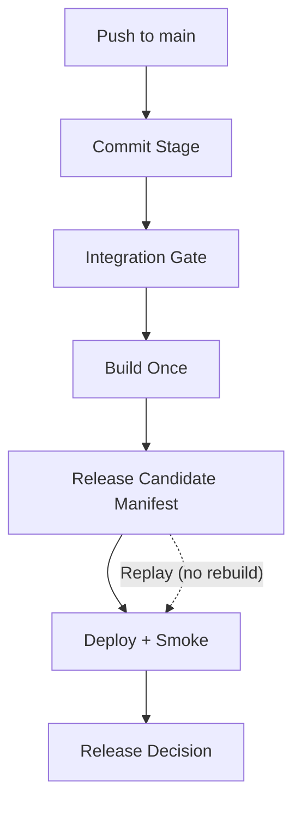

# Development Pipeline (Trunk-Based CD)

This pipeline exists to keep `main` releasable.

## Core Idea

- Every `main` commit must pass two quality gates: `commit-stage` and `integration-gate`.
- After both gates pass, build once and publish one release candidate manifest.
- Deploy and verify that same release candidate.
- Record a final release decision.
- If `main` goes red, fix forward or revert immediately.

## Flow

## In Plain Terms

- `main` is trunk.
- `commit-stage` and `integration-gate` are the required status checks.
- A `release candidate` is immutable (`.artifacts/release-candidate/<sha>/manifest.json`).
- `replay` redeploys an existing release candidate SHA without rebuilding images.

## Evidence

- `.artifacts/commit-stage/<sha>/result.json`
- `.artifacts/integration-gate/<sha>/result.json`
- `.artifacts/release-candidate/<sha>/manifest.json`
- `.artifacts/infra/<sha>/deployment.json`
- `.artifacts/deploy/<sha>/api-smoke.json`
- `.artifacts/release/<sha>/decision.json`

## Source Of Truth

- `.github/policy/pipeline-policy.json`
- `.github/workflows/commit-stage.yml`
- `.github/workflows/integration-gate.yml`
- `.github/workflows/cloud-deployment-pipeline.yml`
- `.github/workflows/cloud-deployment-pipeline-replay.yml`
