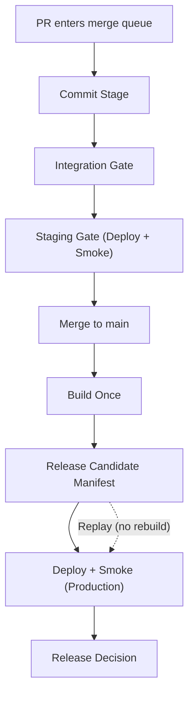

# Development Pipeline (Trunk-Based CD)

Purpose: keep `main` releasable through deterministic quality gates and immutable promotion.

## Core Idea

- Every merge-queue candidate must pass `commit-stage`, `integration-gate`, and `staging-gate` before merge to `main`.
- Every push to `main` must still pass `commit-stage` and `integration-gate`.
- Build once and publish one immutable release candidate manifest.
- Deploy and verify that same release candidate.
- Record a final release decision.
- If post-merge verification fails, halt promotion and fix forward (or ship an explicit human-authored revert commit).

## Flow

```mermaid
flowchart TD
    A["PR enters merge queue"] --> B["Commit Stage"]
    B --> C["Integration Gate"]
    C --> D["Staging Gate (Deploy + Smoke)"]
    D --> E["Merge to main"]
    E --> F["Build Once"]
    F --> G["Release Candidate Manifest"]
    G --> H["Deploy + Smoke (Production)"]
    H --> I["Release Decision"]
    G -. "Replay (no rebuild)" .-> H
```

## Terms

- `trunk`: `main`
- `quality gate`: required status contexts
- `merge queue`: required check execution on merge-group candidate SHA before merge to `main`
- `release candidate`: `.artifacts/release-candidate/<sha>/manifest.json`
- `replay`: redeploy existing release candidate SHA without rebuild

## Evidence

- `.artifacts/commit-stage/<sha>/result.json`
- `.artifacts/integration-gate/<sha>/result.json`
- `.artifacts/staging-gate/<sha>/result.json`
- `.artifacts/release-candidate/<sha>/manifest.json`
- `.artifacts/infra/<sha>/deployment.json`
- `.artifacts/deploy/<sha>/api-smoke.json`
- `.artifacts/release/<sha>/decision.json` (promotion halt reason codes; no auto-revert)

## Source Of Truth

- `.github/policy/pipeline-policy.json`
- `.github/workflows/commit-stage.yml`
- `.github/workflows/integration-gate.yml`
- `.github/workflows/staging-gate.yml`
- `.github/workflows/cloud-deployment-pipeline.yml`
- `.github/workflows/cloud-deployment-pipeline-replay.yml`
