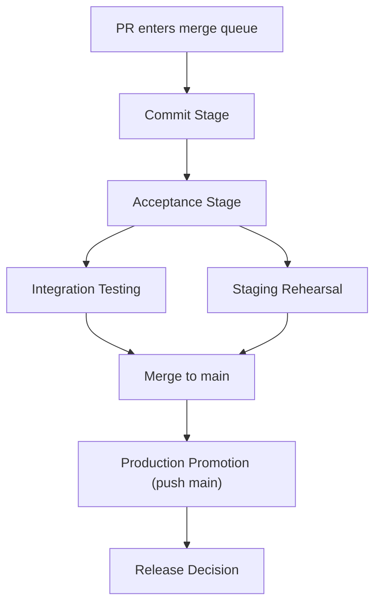

# Development Pipeline (Farley-Aligned Trunk CD)

Purpose: keep `main` releasable with deterministic pre-merge validation and immutable promotion.

## Core Idea

- `main` is updated only through PR + merge queue.
- Merge-queue candidates must pass two required contexts: `commit-stage` and `acceptance-stage`.
- Acceptance stage packages once on merge-group SHA, then runs integration testing and staging rehearsal in parallel.
- Production promotion on `push main` reuses the exact tested release candidate manifest; it never rebuilds.
- Post-merge failures halt promotion and emit incident evidence. Git history is not auto-mutated.

## Flow

```mermaid
flowchart TD
    A["PR enters merge queue"] --> B["Commit Stage"]
    B --> C["Acceptance Stage"]
    C --> D1["Integration Testing"]
    C --> D2["Staging Rehearsal"]
    D1 --> E["Merge to main"]
    D2 --> E
    E --> F["Production Promotion (push main)"]
    F --> G["Release Decision"]
```

## Staging Rehearsal Mode

- Low-risk runtime changes: deploy API/Web candidate revisions at 0% traffic in production, smoke the revision URL, then promote by traffic shift on `push main`.
- High-risk changes (`infra/**`, `db/**`, `.github/**`, `scripts/pipeline/**`, identity, worker/dynamic runtime): run dedicated staging deployment + smoke before merge.

## Evidence

- `.artifacts/commit-stage/<sha>/result.json`
- `.artifacts/acceptance-stage/<sha>/result.json`
- `.artifacts/release-candidate/<sha>/manifest.json`
- `.artifacts/infra/<sha>/deployment.json`
- `.artifacts/deploy/<sha>/api-smoke.json`
- `.artifacts/release/<sha>/decision.json`

## Source Of Truth

- `.github/workflows/commit-stage.yml`
- `.github/workflows/acceptance-stage.yml`
- `.github/workflows/cloud-deployment-pipeline.yml`
- `.github/workflows/cloud-deployment-pipeline-replay.yml`
