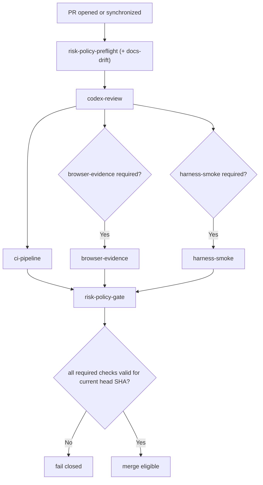

# Merge Policy Contract

This repository enforces a deterministic merge contract defined in `.github/policy/merge-policy.json`.

## Objective

Every PR to `main` must be ship-safe:

1. Risk tier is computed from changed paths.
2. Required evidence is computed from the risk tier.
3. Merge is allowed only when evidence is present, successful, and matches the current head SHA.

## Single required branch-protection check

Branch protection requires only:

- `risk-policy-gate`

`risk-policy-gate` enforces all dynamic tier checks (`ci-pipeline`, `browser-evidence`, `harness-smoke`, `codex-review`) for the current head SHA.
`codex-review` enforcement is controlled by `reviewPolicy.codexReviewEnabled` in `.github/policy/merge-policy.json`.
`risk-policy-gate` enforces required check-runs by result and validates browser evidence manifest assertions only when UI evidence is required.

## Deterministic tiers

- `t0`: low risk
- `t1`: core backend/shared logic and dependency manifests/lockfiles (`package.json`, `pnpm-lock.yaml`, `pnpm-workspace.yaml`)
- `t2`: UI/user flow changes
- `t3`: high risk (`auth`, control-plane config like workflows/policy/dependabot, infra/deploy, migrations)

If multiple tiers match, highest tier wins.

## Deterministic order

1. `risk-policy-preflight` (includes docs-drift evaluation)
2. `codex-review`
3. `ci-pipeline`
4. `browser-evidence` (conditional)
5. `harness-smoke` (conditional)
6. `risk-policy-gate` (final fail-closed enforcement)

## Bootstrap review mode

During bootstrap, `reviewPolicy.codexReviewEnabled` may be `false`:

- `codex-review` still runs and emits deterministic no-op artifacts.
- `risk-policy-gate` does not require `codex-review` in required checks.

When `codex-review` is enabled but `OPENAI_API_KEY` is missing, `codex-review` emits a deterministic
bootstrap no-op artifact instead of failing.

When ready, enable blocking review by:

1. Adding repository secret `OPENAI_API_KEY`.
2. Setting `reviewPolicy.codexReviewEnabled` to `true`.

## Docs drift

`docs-drift` is always evaluated and blocking when either condition is true and docs were not updated:

- Changes match `docsDriftRules.blockingPaths`
- Changes match `docsDriftRules.docsCriticalPaths`

Accepted docs updates are defined in `docsDriftRules.docTargets`.

`docs-drift` runs as part of `risk-policy-preflight` and still emits a standalone
artifact at `.artifacts/docs-drift/<headSha>/result.json`.

## Stale evidence rules

Evidence is valid only when:

- `headSha` matches current PR head SHA
- `tier` matches preflight-computed tier for that head SHA

## Runtime baseline

Control-plane scripts (`preflight`, `docs-drift`, `codex-review`, `gate`) rely on Node core APIs only.
Workflow and local contract checks require Node `24` with minimum `24.8.0` (for `path.posix.matchesGlob`), sourced from `.nvmrc`.

## Flow

