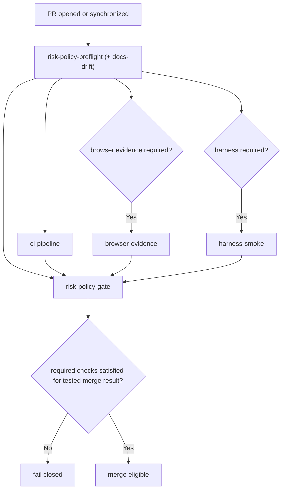

# Merge Policy Contract

This repository enforces a deterministic merge contract defined in `.github/policy/merge-policy.json`.

## Objective

Every PR to `main` must be ship-safe:

1. Risk tier is computed from changed paths.
2. Required evidence is computed from the risk tier.
3. Merge is allowed only when required evidence is present and successful for the tested merge result.

## Source of truth precedence

When this doc and implementation differ, implementation wins:

- Policy truth: `.github/policy/merge-policy.json`
- Enforcement truth: `.github/workflows/merge-contract.yml` and `scripts/ci/gate.mjs`
- This doc is explanatory and must be kept aligned with those files.

## Single required branch-protection check

Branch protection requires only:

- `risk-policy-gate`

`risk-policy-gate` enforces all dynamic checks (`ci-pipeline`, `browser-evidence`, `harness-smoke`) for the tested merge result.

## Deterministic tiers

- `low`: docs and low-risk changes
- `standard`: standard runtime and dependency changes
- `high`: control-plane, infra, migration, and auth-sensitive surfaces

If multiple tiers match, highest tier wins.

## Dependency model (wide pipeline)

The merge workflow is dependency-driven, not serialized:

- `risk-policy-preflight` runs first.
- Then conditional checks run in parallel from preflight outputs:
  - `ci-pipeline` (always)
  - `browser-evidence` (when UI evidence required)
  - `harness-smoke` (when high-risk)
- `risk-policy-gate` is final and verifies `needs.*.result` against required flags.

## Tier Matrix

| Tier       | CI mode | Required checks                                                                |
| ---------- | ------- | ------------------------------------------------------------------------------ |
| `low`      | `fast`  | `risk-policy-gate`, `ci-pipeline`                                              |
| `standard` | `full`  | `risk-policy-gate`, `ci-pipeline` (+ `browser-evidence` when UI paths changed) |
| `high`     | `full`  | `risk-policy-gate`, `ci-pipeline`, `harness-smoke`                             |

## Codex review policy

Codex review is trusted-context only and is not part of the PR blocking merge contract.

- PR merge gate does not execute secret-backed codex review.
- Trusted codex review runs via `codex-review-trusted.yml` (manual `workflow_dispatch`).

## Docs drift

`docs-drift` is always evaluated.

- Blocking: `docsDriftRules.docsCriticalPaths` changed without matching docs target updates.
- Advisory/visible only: `docsDriftRules.blockingPaths` without docs updates.

Result artifact path:

- `.artifacts/docs-drift/<testedSha>/result.json`

## Stale evidence and gate semantics

`risk-policy-gate` makes merge decisions from required job outcomes (`needs.*.result`) plus targeted artifact validation.

- `preflight` must succeed.
- `ci-pipeline` must succeed.
- `browser-evidence` is required only when `browser_required=true`.
- `harness-smoke` is required only when `harness_required=true`.
- If `docs_drift_blocking=true`, `docs_drift_status` must be `pass`.
- For `browser-evidence`, the gate validates manifest assertions including `headSha`, `testedSha`, `tier`, required flow IDs, entrypoint, and expected identity.

## Runtime baseline

Control-plane scripts use Node's built-in `path.posix.matchesGlob` for deterministic pattern behavior.

- Node baseline: `22.x` (`.nvmrc`)
- Engine contract: `>=22 <23`

## Control-plane high-risk paths

`riskTierRules.high` in `.github/policy/merge-policy.json` is authoritative.

Non-exhaustive examples:

- `.github/workflows/*.yml`, `.github/workflows/*.yaml`, `.github/dependabot.yml`
- `.github/policy/**`
- `scripts/ci/**`, `scripts/deploy/**`, `scripts/infra/**`
- `apps/api/src/features/auth/**`
- `infra/**`, `infra/azure/**`, `infra/identity/**`
- `migrations/**`
- `deploy/**`

## Flow

