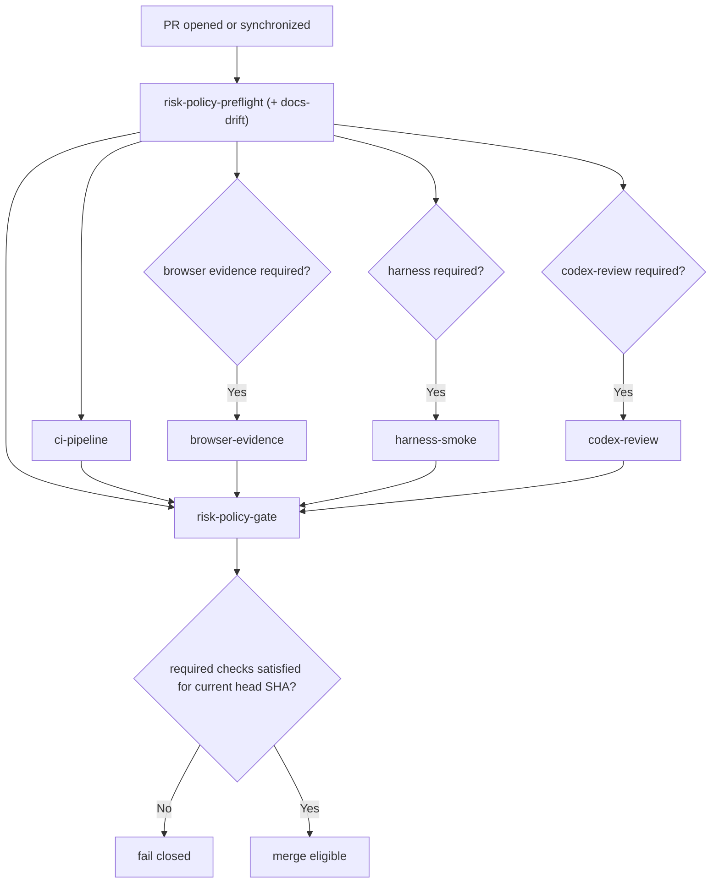

# Merge Policy Contract

This repository enforces a deterministic merge contract defined in `.github/policy/merge-policy.json`.

## Objective

Every PR to `main` must be ship-safe:

1. Risk tier is computed from changed paths.
2. Required evidence is computed from the risk tier.
3. Merge is allowed only when evidence is present, successful, and matches the current head SHA.

## Single required branch-protection check

Branch protection requires only:

- `risk-policy-gate`

`risk-policy-gate` enforces all dynamic checks (`ci-pipeline`, `browser-evidence`, `harness-smoke`, `codex-review`) for the current head SHA.

## Deterministic tiers

- `low`: docs and low-risk changes
- `normal`: standard runtime and dependency changes
- `high`: control-plane, infra, migration, and auth-sensitive surfaces

If multiple tiers match, highest tier wins.

## Dependency model (wide pipeline)

The merge workflow is dependency-driven, not serialized:

- `risk-policy-preflight` runs first.
- Then conditional checks run in parallel from preflight outputs:
  - `ci-pipeline` (always)
  - `browser-evidence` (when UI evidence required)
  - `harness-smoke` (when high-risk)
  - `codex-review` (when enabled + required)
- `risk-policy-gate` is final and verifies `needs.*.result` against required checks.

## Tier Matrix

| Tier     | CI mode | Required checks                                                                   |
| -------- | ------- | --------------------------------------------------------------------------------- |
| `low`    | `fast`  | `risk-policy-gate`, `ci-pipeline`                                                 |
| `normal` | `full`  | `risk-policy-gate`, `ci-pipeline` (+ `browser-evidence` when UI paths changed)    |
| `high`   | `full`  | `risk-policy-gate`, `ci-pipeline`, `harness-smoke`, `codex-review` (when enabled) |

## Codex review policy

`reviewPolicy.codexReviewEnabled` controls whether `codex-review` is required.

- `false`: `codex-review` is excluded from required checks.
- `true`: required high-risk changes must pass `codex-review`.
- If required and `OPENAI_API_KEY` is missing, `codex-review` fails hard.

## Docs drift

`docs-drift` is always evaluated.

- Blocking: `docsDriftRules.docsCriticalPaths` changed without matching docs target updates.
- Advisory/visible only: `docsDriftRules.blockingPaths` without docs updates.

Result artifact path:

- `.artifacts/docs-drift/<headSha>/result.json`

## Stale evidence rules

Evidence is valid only when:

- `headSha` matches current PR head SHA
- `tier` matches preflight-computed tier for that head SHA

## Runtime baseline

Control-plane scripts use Node's built-in `path.posix.matchesGlob` for deterministic pattern behavior.

- Node baseline: `22.x` (`.nvmrc`)
- Engine contract: `>=22 <23`

## Control-plane high-risk paths

- `.github/workflows/*.yml`
- `.github/workflows/*.yaml`
- `.github/policy/**`
- `scripts/ci/**`
- `scripts/deploy/**`
- `scripts/infra/**`
- `infra/azure/**`
- `infra/identity/**`
- `deploy/**`

## Flow

