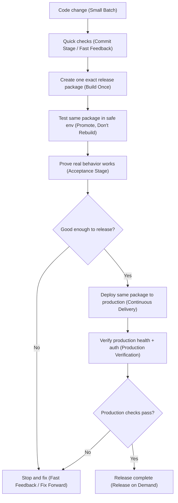

# Cloud Delivery Pipeline Runbook

## Purpose

Run and troubleshoot cloud delivery with one clear flow:

- build one release package
- test that same package in acceptance
- deploy that same package to production
- verify production behavior

## Canonical Flow

## Workflow Files

- Push path: `.github/workflows/cloud-delivery-pipeline.yml`
- Manual replay path: `.github/workflows/cloud-delivery-replay.yml`
- Merge gate: `.github/workflows/commit-stage.yml`

## Trigger Model

- `commit-stage.yml`: `pull_request`, `merge_group`
- `cloud-delivery-pipeline.yml`: `push` to `main`
- `cloud-delivery-replay.yml`: `workflow_dispatch` with `release_package_sha`

## Stage-by-Stage (Simple Language + Farley Terms)

1. Commit Stage / Fast Feedback

- Confirm `main` commit has merge-gate evidence from `commit-stage`.
- Resolve scope and docs drift for the release SHA.

2. Build Once

- Build digest-pinned runtime images when runtime changed.
- If runtime did not change but infra needs convergence, capture current runtime digests.
- Publish one release package manifest.

3. Promote, Don’t Rebuild

- Load `.artifacts/release-package/<sha>/manifest.json`.
- Validate digest refs and release package contract.

4. Acceptance Stage

- Run required acceptance checks by scope.
- Emit one decision: `YES` or `NO`.

5. Continuous Delivery

- If acceptance is `YES` and deploy is required, run production mutation under lock `production-mutation`.
- Deploy the exact package refs from the manifest.

6. Production Verification

- Verify auth canary freshness.
- Verify delegated probe freshness for target SHA.
- Run API smoke and browser smoke.

7. Release on Demand Evidence

- Write final release decision artifact at `.artifacts/release/<sha>/decision.json`.

## Artifact Contracts

- Release package manifest: `.artifacts/release-package/<sha>/manifest.json`
- Acceptance result: `.artifacts/acceptance/<sha>/result.json`
- Production result: `.artifacts/production/<sha>/result.json`
- Final release decision: `.artifacts/release/<sha>/decision.json`
- Timing evidence: `.artifacts/pipeline/<sha>/timing.json`

## Replay Procedure

Use replay when you need to rerun delivery for an existing release package SHA without rebuilding images.

1. Trigger `cloud-delivery-replay.yml`.
2. Provide `release_package_sha`.
3. Replay loads artifact `release-package-<sha>` from a successful push run.
4. Replay runs acceptance -> deploy -> production verification -> release decision.

## Failure Response

- Acceptance failed: fix forward, then merge a new small batch.
- Production verification failed: treat as release failure, fix forward, then re-deliver.
- Replay failure: investigate drift/config issues; replay should fail closed.

## Required Production Auth Inputs (Smoke)

- `API_SMOKE_ALLOWED_TENANT_ID`
- `API_SMOKE_ALLOWED_CLIENT_ID`
- `API_SMOKE_ALLOWED_CLIENT_SECRET`
- `API_SMOKE_ALLOWED_SCOPE`
- `API_SMOKE_DENIED_TENANT_ID`
- `API_SMOKE_DENIED_CLIENT_ID`
- `API_SMOKE_DENIED_CLIENT_SECRET`
- `API_SMOKE_DENIED_SCOPE`
- `API_SMOKE_DENIED_EXPECTED_CODE`

## Non-Negotiables

- Do not rebuild runtime images in production stage jobs.
- Keep production mutation serialized (`production-mutation`).
- Keep acceptance credentials read-only and separate from production credentials.
- Keep branch protection simple: only `commit-stage` is required.
