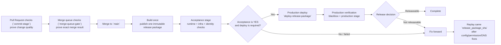

# Cloud Deployment Pipeline Setup

> manual bootstrap once, then one automated pipeline path for every change.

## Automated Pipeline Flow



## Manual Bootstrap Once

### Prerequisites

- Azure tenant-level admin access to assign `Application Administrator`.
- Azure subscription RBAC rights to create RG/storage/ACR and assign roles.
- GitHub repo admin rights to edit `acceptance` and `production` environment vars/secrets.
- Local tools: `az`, `gh`, `terraform`, `pnpm`.

### Checklist (run once per environment)

1. Select the target tenant and subscription.

```bash
az login --tenant "$AZURE_TENANT_ID"
az account set --subscription "$AZURE_SUBSCRIPTION_ID"
az account show --query "{tenantId:tenantId,id:id,name:name}" -o table
```

Verification: tenant/subscription match intended production IDs.

2. Create anchor resource groups, tfstate backend, and ACR.

```bash
az group create -n "$AZURE_RESOURCE_GROUP" -l "$AZURE_LOCATION"
az group create -n "$TFSTATE_RESOURCE_GROUP" -l "$AZURE_LOCATION"
az storage account create -g "$TFSTATE_RESOURCE_GROUP" -n "$TFSTATE_STORAGE_ACCOUNT" -l "$AZURE_LOCATION" --sku Standard_LRS
az storage container create --account-name "$TFSTATE_STORAGE_ACCOUNT" -n "$TFSTATE_CONTAINER" --auth-mode login
az acr create -g "$AZURE_RESOURCE_GROUP" -n "$ACR_NAME" -l "$AZURE_LOCATION" --sku Basic --admin-enabled false
```

Verification: `az group show`, `az storage account show`, and `az acr show` all succeed.

3. Create bootstrap Entra identity, add OIDC federation, and grant required permissions.

```bash
BOOTSTRAP_APP_NAME="compass-identity-bootstrap-prod"
BOOTSTRAP_APP_ID="$(az ad app create --display-name "$BOOTSTRAP_APP_NAME" --query appId -o tsv)"
az ad sp create --id "$BOOTSTRAP_APP_ID" >/dev/null
cat > /tmp/federated-production.json <<'JSON'
{"name":"github-production","issuer":"https://token.actions.githubusercontent.com","subject":"repo:glcsolutions-ca/compass:environment:production","audiences":["api://AzureADTokenExchange"]}
JSON
cat > /tmp/federated-acceptance.json <<'JSON'
{"name":"github-acceptance","issuer":"https://token.actions.githubusercontent.com","subject":"repo:glcsolutions-ca/compass:environment:acceptance","audiences":["api://AzureADTokenExchange"]}
JSON
az ad app federated-credential create --id "$BOOTSTRAP_APP_ID" --parameters @/tmp/federated-production.json
az ad app federated-credential create --id "$BOOTSTRAP_APP_ID" --parameters @/tmp/federated-acceptance.json
az role assignment create --assignee "$BOOTSTRAP_APP_ID" --role Contributor --scope "/subscriptions/$AZURE_SUBSCRIPTION_ID"
az role assignment create --assignee "$BOOTSTRAP_APP_ID" --role "User Access Administrator" --scope "/subscriptions/$AZURE_SUBSCRIPTION_ID/resourceGroups/$AZURE_RESOURCE_GROUP"
az role assignment create --assignee "$BOOTSTRAP_APP_ID" --role "Storage Blob Data Contributor" --scope "/subscriptions/$AZURE_SUBSCRIPTION_ID/resourceGroups/$TFSTATE_RESOURCE_GROUP/providers/Microsoft.Storage/storageAccounts/$TFSTATE_STORAGE_ACCOUNT"
```

Also assign Entra directory role `Application Administrator` to the bootstrap service principal.

Verification: federated credentials exist, RBAC assignments list correctly, and Entra role assignment is visible.

4. Populate required GitHub environment variables and secrets.

```bash
gh variable set -e production AZURE_TENANT_ID --body "$AZURE_TENANT_ID"
gh variable set -e production AZURE_SUBSCRIPTION_ID --body "$AZURE_SUBSCRIPTION_ID"
gh variable set -e production ACA_CODEX_APP_NAME --body "$ACA_CODEX_APP_NAME"
gh secret set -e production AZURE_DEPLOY_CLIENT_ID --body "$BOOTSTRAP_APP_ID"
gh secret set -e production AZURE_IDENTITY_CLIENT_ID --body "$BOOTSTRAP_APP_ID"

gh variable set -e acceptance ACA_CODEX_APP_NAME --body "$ACA_CODEX_APP_NAME"
gh secret set -e acceptance AZURE_ACCEPTANCE_CLIENT_ID --body "$BOOTSTRAP_APP_ID"
gh secret set -e acceptance AZURE_ACCEPTANCE_IDENTITY_CLIENT_ID --body "$BOOTSTRAP_APP_ID"
```

Verification: `gh variable list -e production`, `gh variable list -e acceptance`, `gh secret list -e production`, and `gh secret list -e acceptance` include required entries.

5. Run manual Terraform identity apply (one-time bootstrap convergence).

```bash
terraform -chdir=infra/identity init \
  -backend-config="resource_group_name=$TFSTATE_RESOURCE_GROUP" \
  -backend-config="storage_account_name=$TFSTATE_STORAGE_ACCOUNT" \
  -backend-config="container_name=$TFSTATE_CONTAINER" \
  -backend-config="key=$TFSTATE_KEY" \
  -backend-config="use_oidc=true" \
  -backend-config="use_azuread_auth=true" \
  -backend-config="tenant_id=$AZURE_TENANT_ID" \
  -backend-config="subscription_id=$AZURE_SUBSCRIPTION_ID" \
  -backend-config="client_id=$BOOTSTRAP_APP_ID"

terraform -chdir=infra/identity apply -auto-approve \
  -var-file=env/prod.tfvars \
  -var "github_organization=$GH_ORGANIZATION" \
  -var "github_repository=$GH_REPOSITORY_NAME" \
  -var "github_environment_name=production" \
  -var "api_identifier_uri=$API_IDENTIFIER_URI" \
  -var "owners=$IDENTITY_OWNER_OBJECT_IDS_JSON"
```

Verification: `terraform -chdir=infra/identity output` returns API/web/deploy/smoke app IDs.

6. Run manual Bicep infra validate/create (first platform bring-up).

```bash
az deployment group validate \
  --resource-group "$AZURE_RESOURCE_GROUP" \
  --template-file infra/azure/main.bicep \
  --parameters @infra/azure/environments/prod.bicepparam

az deployment group create \
  --name "bootstrap-$(date -u +%Y%m%dT%H%M%SZ)" \
  --resource-group "$AZURE_RESOURCE_GROUP" \
  --template-file infra/azure/main.bicep \
  --parameters @infra/azure/environments/prod.bicepparam
```

Verification: container apps, ACA environment, Postgres, and ACR resources exist and are healthy.

7. Complete custom domain DNS and managed certificate prerequisites.

```bash
AZURE_RESOURCE_GROUP="$AZURE_RESOURCE_GROUP" \
ACA_API_APP_NAME="$ACA_API_APP_NAME" \
ACA_WEB_APP_NAME="$ACA_WEB_APP_NAME" \
ACA_CODEX_APP_NAME="$ACA_CODEX_APP_NAME" \
ACA_API_CUSTOM_DOMAIN="$ACA_API_CUSTOM_DOMAIN" \
ACA_WEB_CUSTOM_DOMAIN="$ACA_WEB_CUSTOM_DOMAIN" \
ACA_CODEX_CUSTOM_DOMAIN="$ACA_CODEX_CUSTOM_DOMAIN" \
pnpm deploy:custom-domain:dns
```

Publish generated DNS records, wait for propagation, then verify hostname bindings and managed certificates in ACA.

8. Emit bootstrap evidence artifact checklist.

```bash
TS="$(date -u +%Y%m%dT%H%M%SZ)"
mkdir -p ".artifacts/bootstrap/$TS"
az account show > ".artifacts/bootstrap/$TS/account.json"
az group list --query "[?starts_with(name, 'rg-compass')].{name:name,location:location}" > ".artifacts/bootstrap/$TS/resource-groups.json"
terraform -chdir=infra/identity output -json > ".artifacts/bootstrap/$TS/identity-outputs.json"
gh variable list -e production > ".artifacts/bootstrap/$TS/github-production-vars.txt"
gh secret list -e production > ".artifacts/bootstrap/$TS/github-production-secrets.txt"
```

Verification: artifact folder contains account, anchor resources, identity outputs, and GitHub config evidence.

After this one-time bootstrap, normal changes flow only through GitHub workflows.

## FAQs

### Why is bootstrap manual?

Bootstrap is rare, privileged, and high impact. Manual steps keep every mutation visible and auditable.

### What is automated after bootstrap?

All routine delivery on `main`: build once, acceptance checks, production deploy, production verification, and release decision.

### What triggers infra versus identity apply?

`infra/azure/**` changes trigger infra convergence. `infra/identity/**` changes trigger identity convergence. Mixed changes run both.

### Why are custom domains required at bootstrap?

Production readiness includes real production hostnames and certificates. The pipeline assumes domains are part of the normal steady state.

### How does replay work?

`cloud-delivery-replay.yml` reruns acceptance, deploy, and verification for the same immutable `release_package_sha`.

### What if failure is config, RBAC, or DNS only?

Fix config/permissions/DNS, then replay the same SHA. No rebuild is needed.

### What if failure is code or workflow logic?

Fix in a PR, merge to `main`, and run a clean verification cycle to prove the new logic from scratch.

### Where is delivery evidence stored?

Under `.artifacts/<area>/<sha>/` (for example `release-package`, `infra`, `identity`, `production`, `release`).

### Why split Bicep and Terraform?

Bicep handles Azure resource topology; Terraform handles Entra identity lifecycle. This matches current strengths and avoids unnecessary state migration risk.

### What should an operator remember?

One manual bootstrap, then one deterministic automated pipeline path for every change.
