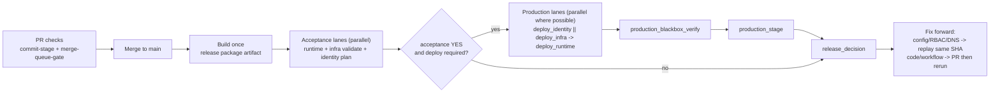

# Cloud Deployment Pipeline Setup

> manual bootstrap once, then one automated pipeline path for every change.

## Automated Pipeline Flow



## Manual Bootstrap Once

Bootstrap is privileged setup only. Do this once, then let the pipeline create and maintain the app stack.

1. Select tenant/subscription.

```bash
az login --tenant "$AZURE_TENANT_ID"
az account set --subscription "$AZURE_SUBSCRIPTION_ID"
az account show --query "{tenantId:tenantId,id:id,name:name}" -o table
```

2. Create anchor resources (prod RG, tfstate RG/storage/container, ACR).

```bash
az group create -n "$AZURE_RESOURCE_GROUP" -l "$AZURE_LOCATION"
az group create -n "$TFSTATE_RESOURCE_GROUP" -l "$AZURE_LOCATION"
az storage account create \
  -g "$TFSTATE_RESOURCE_GROUP" \
  -n "$TFSTATE_STORAGE_ACCOUNT" \
  -l "$AZURE_LOCATION" \
  --sku Standard_LRS
az storage container create \
  --account-name "$TFSTATE_STORAGE_ACCOUNT" \
  -n "$TFSTATE_CONTAINER" \
  --auth-mode login
az acr create \
  -g "$AZURE_RESOURCE_GROUP" \
  -n "$ACR_NAME" \
  -l "$AZURE_LOCATION" \
  --sku Basic \
  --admin-enabled false
```

3. Create bootstrap Entra app/SP, add OIDC federation for `acceptance` + `production`, assign Entra and Azure roles.

```bash
BOOTSTRAP_APP_NAME="compass-identity-bootstrap-prod"
BOOTSTRAP_APP_ID="$(az ad app create --display-name "$BOOTSTRAP_APP_NAME" --query appId -o tsv)"
az ad sp create --id "$BOOTSTRAP_APP_ID" >/dev/null

cat > /tmp/compass-fic-production.json <<'JSON'
{"name":"github-production","issuer":"https://token.actions.githubusercontent.com","subject":"repo:glcsolutions-ca/compass:environment:production","audiences":["api://AzureADTokenExchange"]}
JSON
cat > /tmp/compass-fic-acceptance.json <<'JSON'
{"name":"github-acceptance","issuer":"https://token.actions.githubusercontent.com","subject":"repo:glcsolutions-ca/compass:environment:acceptance","audiences":["api://AzureADTokenExchange"]}
JSON

az ad app federated-credential create --id "$BOOTSTRAP_APP_ID" --parameters @/tmp/compass-fic-production.json
az ad app federated-credential create --id "$BOOTSTRAP_APP_ID" --parameters @/tmp/compass-fic-acceptance.json

az role assignment create --assignee "$BOOTSTRAP_APP_ID" --role Contributor --scope "/subscriptions/$AZURE_SUBSCRIPTION_ID"
az role assignment create --assignee "$BOOTSTRAP_APP_ID" --role "User Access Administrator" --scope "/subscriptions/$AZURE_SUBSCRIPTION_ID/resourceGroups/$AZURE_RESOURCE_GROUP"
az role assignment create --assignee "$BOOTSTRAP_APP_ID" --role "Storage Blob Data Contributor" --scope "/subscriptions/$AZURE_SUBSCRIPTION_ID/resourceGroups/$TFSTATE_RESOURCE_GROUP/providers/Microsoft.Storage/storageAccounts/$TFSTATE_STORAGE_ACCOUNT"
```

Also assign Entra directory role `Application Administrator` to the bootstrap service principal.

4. Run Terraform identity apply manually one time.

```bash
GITHUB_REPOSITORY="${GITHUB_REPOSITORY:-$(gh repo view --json nameWithOwner -q .nameWithOwner)}"
gh_org="${GITHUB_REPOSITORY%%/*}"
gh_repo="${GITHUB_REPOSITORY##*/}"

terraform -chdir=infra/identity init \
  -backend-config="resource_group_name=$TFSTATE_RESOURCE_GROUP" \
  -backend-config="storage_account_name=$TFSTATE_STORAGE_ACCOUNT" \
  -backend-config="container_name=$TFSTATE_CONTAINER" \
  -backend-config="key=$TFSTATE_KEY" \
  -backend-config="use_oidc=true" \
  -backend-config="use_azuread_auth=true" \
  -backend-config="tenant_id=$AZURE_TENANT_ID" \
  -backend-config="subscription_id=$AZURE_SUBSCRIPTION_ID" \
  -backend-config="client_id=$BOOTSTRAP_APP_ID"

terraform -chdir=infra/identity apply -auto-approve \
  -var-file=env/prod.tfvars \
  -var "github_organization=$gh_org" \
  -var "github_repository=$gh_repo" \
  -var "github_environment_name=production" \
  -var "api_identifier_uri=$API_IDENTIFIER_URI" \
  -var "owners=$IDENTITY_OWNER_OBJECT_IDS_JSON"
```

5. Populate GitHub environment variables and secrets.

Set these in both `acceptance` and `production` unless noted:

### Required Variables

| Variable                              | production | acceptance |
| ------------------------------------- | ---------- | ---------- |
| `AZURE_TENANT_ID`                     | required   | required   |
| `AZURE_SUBSCRIPTION_ID`               | required   | required   |
| `AZURE_RESOURCE_GROUP`                | required   | required   |
| `AZURE_LOCATION`                      | required   | required   |
| `AZURE_VNET_NAME`                     | required   | required   |
| `AZURE_ACA_SUBNET_NAME`               | required   | required   |
| `AZURE_POSTGRES_SUBNET_NAME`          | required   | required   |
| `AZURE_PRIVATE_DNS_ZONE_NAME`         | required   | required   |
| `AZURE_LOG_ANALYTICS_WORKSPACE_NAME`  | required   | required   |
| `ACA_ENVIRONMENT_NAME`                | required   | required   |
| `ACA_API_APP_NAME`                    | required   | required   |
| `ACA_WEB_APP_NAME`                    | required   | required   |
| `ACA_CODEX_APP_NAME`                  | required   | required   |
| `ACA_MIGRATE_JOB_NAME`                | required   | required   |
| `ACR_NAME`                            | required   | required   |
| `ACR_PULL_IDENTITY_NAME`              | required   | required   |
| `POSTGRES_SERVER_NAME`                | required   | required   |
| `POSTGRES_DATABASE_NAME`              | required   | required   |
| `POSTGRES_ADMIN_USERNAME`             | required   | required   |
| `TFSTATE_RESOURCE_GROUP`              | required   | required   |
| `TFSTATE_STORAGE_ACCOUNT`             | required   | required   |
| `TFSTATE_CONTAINER`                   | required   | required   |
| `TFSTATE_KEY`                         | required   | required   |
| `API_IDENTIFIER_URI`                  | required   | required   |
| `AUTH_AUDIENCE`                       | required   | required   |
| `AUTH_ALLOWED_CLIENT_IDS`             | required   | required   |
| `AUTH_ACTIVE_TENANT_IDS`              | required   | required   |
| `AUTH_BOOTSTRAP_DELEGATED_USER_OID`   | required   | required   |
| `AUTH_BOOTSTRAP_DELEGATED_USER_EMAIL` | required   | required   |
| `OAUTH_TOKEN_ISSUER`                  | required   | required   |
| `OAUTH_TOKEN_AUDIENCE`                | required   | required   |
| `API_SMOKE_ALLOWED_TENANT_ID`         | required   | required   |
| `API_SMOKE_DENIED_TENANT_ID`          | required   | required   |
| `ACA_API_CUSTOM_DOMAIN`               | optional   | optional   |
| `ACA_WEB_CUSTOM_DOMAIN`               | optional   | optional   |
| `ACA_CODEX_CUSTOM_DOMAIN`             | optional   | optional   |
| `IDENTITY_OWNER_OBJECT_IDS_JSON`      | required   | required   |

### Required Secrets

| Secret                                | production | acceptance |
| ------------------------------------- | ---------- | ---------- |
| `AZURE_DEPLOY_CLIENT_ID`              | required   | n/a        |
| `AZURE_IDENTITY_CLIENT_ID`            | required   | n/a        |
| `AZURE_ACCEPTANCE_CLIENT_ID`          | n/a        | required   |
| `AZURE_ACCEPTANCE_IDENTITY_CLIENT_ID` | n/a        | required   |
| `POSTGRES_ADMIN_PASSWORD`             | required   | required   |
| `OAUTH_TOKEN_SIGNING_SECRET`          | required   | required   |
| `API_SMOKE_ALLOWED_CLIENT_ID`         | required   | required   |
| `API_SMOKE_ALLOWED_CLIENT_SECRET`     | required   | required   |
| `API_SMOKE_DENIED_CLIENT_ID`          | required   | required   |
| `API_SMOKE_DENIED_CLIENT_SECRET`      | required   | required   |

6. Trigger the first infra-scope PR (for example a non-functional comment in `infra/azure/main.bicep`) and merge to `main`.

This first merged run is what creates the full platform (ACA env/apps/job, Postgres, networking, identities wired into infra runtime config).

7. After first successful deploy, capture the default ACA API FQDN for operator records and smoke troubleshooting.

```bash
api_fqdn="$(az containerapp show -g "$AZURE_RESOURCE_GROUP" -n "$ACA_API_APP_NAME" --query properties.configuration.ingress.fqdn -o tsv)"
echo "API default URL: https://$api_fqdn"
```

8. Optional custom-domain cut-in (later).

- Set `ACA_API_CUSTOM_DOMAIN`, `ACA_WEB_CUSTOM_DOMAIN`, and optional `ACA_CODEX_CUSTOM_DOMAIN`.
- Publish DNS records for domain ownership/validation.
- Run normal infra convergence through the same pipeline path.
- Update external operational probes to the custom host once cut-in is complete.

9. Save bootstrap evidence.

```bash
ts="$(date -u +%Y%m%dT%H%M%SZ)"
mkdir -p ".artifacts/bootstrap/$ts"
az account show > ".artifacts/bootstrap/$ts/account.json"
az group show -n "$AZURE_RESOURCE_GROUP" > ".artifacts/bootstrap/$ts/prod-rg.json"
az group show -n "$TFSTATE_RESOURCE_GROUP" > ".artifacts/bootstrap/$ts/tfstate-rg.json"
terraform -chdir=infra/identity output -json > ".artifacts/bootstrap/$ts/identity-outputs.json"
gh variable list -e production > ".artifacts/bootstrap/$ts/gh-production-vars.txt"
gh secret list -e production > ".artifacts/bootstrap/$ts/gh-production-secrets.txt"
gh variable list -e acceptance > ".artifacts/bootstrap/$ts/gh-acceptance-vars.txt"
gh secret list -e acceptance > ".artifacts/bootstrap/$ts/gh-acceptance-secrets.txt"
```

## FAQs

### Why is bootstrap manual?

It is rare and privileged. Manual keeps each mutation explicit and auditable.

### What happens automatically after bootstrap?

Every `main` change goes through one path: acceptance checks, production deploy (when required), production verify, release decision.

### What triggers infra deploy vs identity deploy?

`infra/azure/**` changes trigger infra convergence. `infra/identity/**` changes trigger identity convergence. Mixed changes run both.

### Why start with default ACA domains?

It removes DNS/certificate timing from initial bring-up and gets the core platform running first.

### How do we switch to custom domains later?

Set `ACA_*_CUSTOM_DOMAIN` vars, publish DNS, run normal pipeline convergence, then update base URLs/probes.

### Is there a second pipeline mode for domains?

No. There is one pipeline path. Custom domains are controlled only by optional domain vars.

### When do we replay the same SHA?

For config/permission/DNS fixes. Replay validates deterministic convergence without rebuilding artifacts.

### What if the failure is code or workflow logic?

Fix in a PR to `main`, then run again. Do not treat a failed run as production proof.

### Where is evidence written?

Under `.artifacts/<area>/<sha>/` and `.artifacts/bootstrap/<timestamp>/`.
