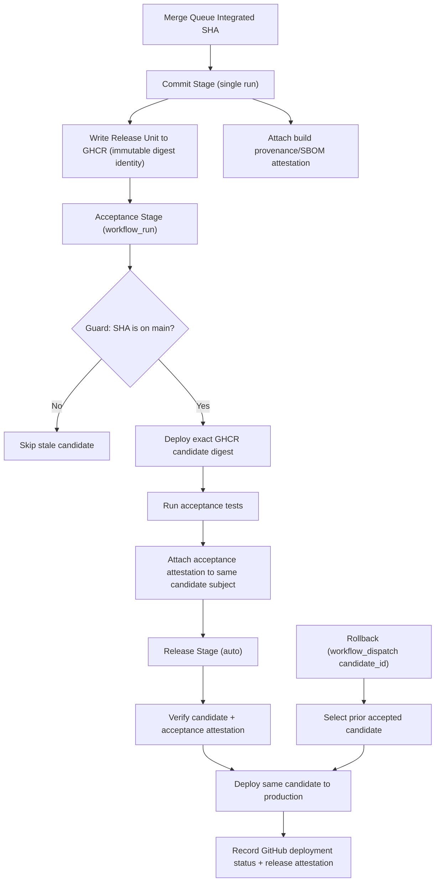

# Pipeline

This folder defines the canonical deployment pipeline model for Compass.

## Minimum Viable Farley 3-Stage Requirements

1. One immutable candidate identity per integrated SHA.
2. One authoritative Commit Stage build that writes that candidate to GHCR.
3. One acceptance verdict bound to that exact candidate.
4. One production deployment of that same candidate.
5. One rollback path to a previously accepted candidate.
6. Commit Stage runs once per candidate (no duplicate PR run).
7. Acceptance runs via `workflow_run` from successful Commit Stage.
8. Release is fully automatic after acceptance success.
9. Production rehearsal evidence and commit SLO gating are removed.

## Canonical Flow

## What We Actually Need

The pipeline exists to answer one question:

Can we safely release this exact integrated candidate now?

Everything outside that purpose is optional tooling.

## Stage Order

1. `Commit Stage`
2. `Acceptance Stage`
3. `Release Stage`

## System of Record

GHCR is the canonical artifact and stage-evidence store.

1. Commit Stage publishes runtime artifacts and release-unit metadata.
2. Acceptance reads that exact candidate and writes acceptance attestation.
3. Release reads that exact candidate plus acceptance attestation, deploys unchanged, and writes release attestation.

## Invariants

1. Build once in `Commit Stage`.
2. Promote unchanged digest-pinned artifacts.
3. Candidate identity is `candidateId=sha-<40-char source SHA>`.
4. Acceptance must fail closed.
5. Release must fail closed if acceptance attestation is missing or non-pass.
6. Rollback uses previously accepted candidate identity, not source rebuilds.

## Ownership Boundaries

- `.github/workflows` orchestrates CI/CD execution.
- `pipeline/contracts` defines candidate and attestation predicate contracts.
- `pipeline/shared/scripts` contains reusable mechanics.
- `pipeline/stages/*` contains stage-specific scripts/tests/runbooks.
