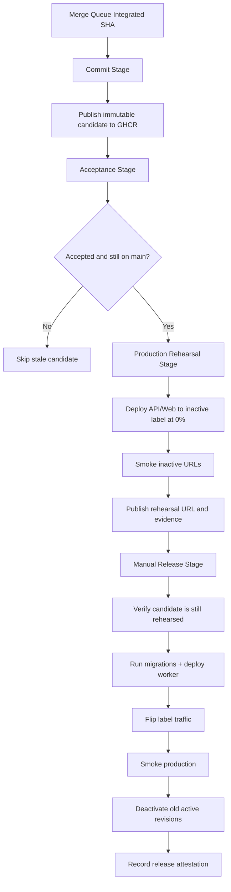

# Pipeline

This folder defines the canonical deployment pipeline model for Compass.

## Required 4-Stage Flow

1. One immutable candidate identity per integrated SHA.
2. One authoritative Commit Stage build that writes that candidate to GHCR.
3. One acceptance verdict bound to that exact candidate.
4. One production rehearsal of that same candidate at `0%` traffic.
5. One manual production promotion of that same rehearsed candidate.
6. One rollback path to a previously accepted candidate.

## Canonical Flow

## Stage Order

1. `Commit Stage`
2. `Acceptance Stage`
3. `Production Rehearsal Stage`
4. `Release Stage`

## Queue Admission

`pull_request` queue admission is handled by `.github/workflows/00-queue-admission.yml` and is intentionally non-authoritative. The authoritative candidate build/publish path remains `.github/workflows/01-commit-stage.yml` on `merge_group` only.

## Hardening Baseline

1. Pipeline workflow actions are pinned to full commit SHAs and updated through Dependabot.
2. Privileged downstream stages avoid `pnpm` cache by default.
3. Production deployments are restricted to `main` via GitHub environment branch policy.
4. Human promotion approval lives in GitHub Environments.

## System of Record

GHCR is the canonical artifact and stage-evidence store.

1. Commit Stage publishes runtime artifacts, the release-unit index, and the candidate manifest package to GHCR.
2. Acceptance resolves the candidate from GHCR and attaches acceptance attestation.
3. Production Rehearsal resolves the same candidate from GHCR and records workflow evidence.
4. Release resolves the same candidate from GHCR and attaches release attestation.
5. Promotion is gated by acceptance attestation plus GitHub `production` environment approval.

## Invariants

1. Build once in Commit Stage.
2. Promote unchanged digest-pinned artifacts.
3. Candidate identity is `candidateId=sha-<40-char source SHA>`.
4. API and Web promotion is a traffic switch.
5. Fast rollback is a traffic switch back.
6. Durable rollback is re-promoting a previously accepted candidate.

## Ownership Boundaries

- `.github/workflows` orchestrates CI/CD execution.
- `pipeline/contracts` defines candidate and evidence contracts.
- `pipeline/shared/scripts` contains reusable mechanics.
- `pipeline/stages/*` contains stage-specific scripts, tests, and runbooks.
- `pipeline/runbooks` contains operational procedures.
