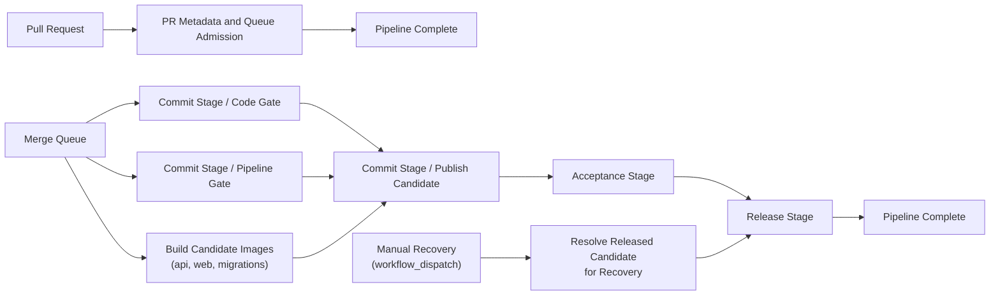

# Pipeline

The diagram above mirrors the actual GitHub Actions job dependency graph at a high level: one PR-only workflow for metadata and queue admission, one cloud delivery workflow for Commit, Acceptance, and Release, and a separate manual recovery entry into Release.

Compass uses a single development pipeline built around one principle: **build the release candidate once, then promote that same candidate through the rest of the pipeline**.

The pipeline follows a Farley-style stage model:

- `Commit Stage` is the first real stage
- `Acceptance Stage` proves behavior on the same candidate
- `Release Stage` deploys that already-validated candidate

`Queue Admission` exists only because GitHub merge queue requires a lightweight PR-time check before a pull request can enter the queue. It is a GitHub prerequisite, not part of the deployment pipeline proper.

## Overview

A normal change reaches production like this:

1. A pull request is reviewed.
2. `00-pr-metadata-and-admission.yml` applies labels and confirms the repository is sane enough to enter merge queue.
3. GitHub creates a `merge_group` branch that represents the integrated code.
4. `Commit Stage` runs first on that integrated code and creates the immutable release candidate.
5. `Acceptance Stage` tests that same candidate from the user or system perspective.
6. `Release Stage` deploys that same candidate to production.
7. If the full pipeline passes, the queued change merges to `main`.

This is why the real delivery pipeline runs on `merge_group` rather than on the pull request branch: the first real stage should validate integrated code, not a stale branch head.

## Stage Model

### PR Metadata and Queue Admission

Purpose:

- apply pull request labels
- satisfy GitHub merge queue requirements
- keep PR-time work minimal

This workflow runs on `pull_request` only.

It applies informational labels using standard GitHub labeling behavior and runs the minimal repository sanity checks required for merge queue entry:

- workflow linting
- Bicep validation
- legacy-reference audit

It does **not** run the delivery pipeline. It does not build images, publish candidates, run acceptance tests, or deploy anything.

Labels are metadata only. They communicate scope and risk hints; they do not control which delivery pipeline runs.

### Commit Stage

Purpose:

- catch the majority of problems quickly
- validate integrated code
- create the release candidate once

Commit Stage is the first real stage in the pipeline. It runs on `merge_group`, not on the pull request branch.

Its required scope is intentionally limited to the deployed surface:

- `api`
- `web`
- `db-tools` / migrations
- `contracts`
- `sdk`

Non-deployed code, such as `apps/worker`, remains in the repository but is not part of the required merge-queue path.

Commit Stage is split into parallel jobs so it stays fast without changing its purpose:

- code gate
- pipeline/repository gate
- candidate image builds
- candidate publishing

The important rule is that Commit is the **only** stage that creates:

- the candidate manifest
- the release unit
- the canonical image digests

### Acceptance Stage

Purpose:

- prove that the system behaves correctly
- validate the exact candidate created in Commit

Acceptance is slower than Commit by design. Commit asks, “is this change mechanically sound?” Acceptance asks, “does this exact artifact behave correctly?”

The required Acceptance path is intentionally smoke-only:

- one system smoke
- one browser smoke

Acceptance uses the exact candidate from Commit:

- local Postgres
- migrations container from the candidate
- API container from the candidate
- Web container from the candidate

It does not rebuild images or substitute artifacts.

### Release Stage

Purpose:

- deploy the already-validated candidate to production

Release consumes the same candidate that Commit built and Acceptance validated.

For normal forward delivery, Release:

1. verifies the acceptance attestation
2. applies infrastructure changes when required
3. deploys the candidate to stage apps
4. runs read-only stage smoke
5. runs migrations
6. deploys the same candidate to prod apps
7. runs production smoke
8. records release evidence and release attestation

Release is automatic after Acceptance succeeds on the merge-queue path.

## Release Candidate Model

The release candidate is the central object in this pipeline.

Rules:

- it is created once in Commit
- it is immutable
- Acceptance consumes it
- Release consumes it
- later stages do not rebuild it

That is the core continuity guarantee in the pipeline: the thing that gets tested is the thing that gets released.

## Workflow Topology

The canonical implementation lives in:

- [00-pr-metadata-and-admission.yml](/Users/justinkropp/.codex/worktrees/2bfd/compass/.github/workflows/00-pr-metadata-and-admission.yml)
- [01-cloud-development-pipeline.yml](/Users/justinkropp/.codex/worktrees/2bfd/compass/.github/workflows/01-cloud-development-pipeline.yml)

The PR workflow handles:

- `pull_request` for labels and Queue Admission only

The cloud delivery workflow handles:

- `merge_group` for normal delivery
- `workflow_dispatch` for rare recovery redeploy of a previously released candidate

`Pipeline Complete` is the single required branch-protection check.

## Production Model

The pipeline currently deploys into a simplified production architecture:

- one Azure production resource group
- one GitHub deployment environment: `production`
- long-lived ACA stage/prod app pairs
- automatic forward release after Acceptance success

This keeps the delivery path direct and easy to reason about while still allowing stage smoke before production deployment.

## Recovery Policy

The preferred operational response is to **fix forward** with a new candidate through the normal pipeline.

Manual recovery redeploy exists only as a rare fallback. It is not an alternate path for new changes.

Recovery redeploy:

- is only allowed for a **previously released** candidate
- verifies prior **release attestation**
- skips infrastructure apply
- skips migrations
- still uses the same stage -> prod deployment flow
- still runs stage and production smoke

If a previously released candidate is no longer compatible with the current database schema, recovery redeploy is unsupported and the correct response is a forward fix.

## What This README Is Optimizing For

This pipeline is intentionally designed for:

- clarity of stage boundaries
- one canonical path for new changes
- immutable candidates promoted through the pipeline
- minimal incidental complexity

It is **not** optimized around adding extra mechanisms unless they materially strengthen the delivery model. The point is to keep the pipeline small, comprehensible, and operationally predictable.
