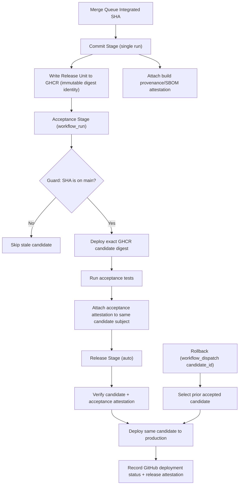

# Pipeline Stages (Farley 3-Stage Model)

This document defines the canonical stage model for `pipeline/stages`.

## Minimum Viable Farley 3-Stage Requirements

1. One immutable candidate identity per integrated SHA.
2. One authoritative Commit Stage build that writes that candidate to GHCR.
3. One acceptance verdict bound to that exact candidate.
4. One production deployment of that same candidate.
5. One rollback path to a previously accepted candidate.
6. Commit Stage runs once per candidate (no duplicate PR run).
7. Acceptance runs via `workflow_run` from successful Commit Stage.
8. Release is fully automatic after acceptance success.
9. Production rehearsal evidence and commit SLO gating are removed.

## Canonical Flow

## What We Actually Need

The deployment pipeline only needs to prove that the exact integrated candidate can be promoted to production unchanged. Everything else is optional tooling.

## Stage Contracts

### Commit Stage

Purpose:

- Build and publish one authoritative candidate for one integrated SHA.

Must do:

1. Run authoritatively on `merge_group` only.
2. Expose a lightweight PR-head `Commit Stage` status check for merge-queue admission (no rebuild, no publication).
3. Execute fast commit checks for the authoritative run.
4. Build and push immutable digest-pinned runtime artifacts.
5. Publish candidate representations to GHCR.
6. Attach build provenance/SBOM attestations.
7. Emit commit-stage metadata artifact for downstream stage resolution.
8. Fail closed when any required step fails.

Must not do:

1. Run on PR as a second authoritative path.
2. Depend on downstream environment state.
3. Introduce nonessential gates (for example commit-stage SLO blocking).

### Acceptance Stage

Purpose:

- Prove that the exact candidate from Commit Stage behaves correctly.

Must do:

1. Trigger from successful Commit Stage via `workflow_run`.
2. Resolve candidate identity from commit-stage metadata on the triggering run.
3. Guard against stale candidates by requiring SHA presence on `main`.
4. Deploy exact candidate digests from GHCR.
5. Run automated acceptance suites.
6. Attach acceptance attestation to candidate subject.
7. Emit acceptance-stage metadata artifact for release-stage resolution.
8. Fail closed on test or attestation errors.

Must not do:

1. Rebuild artifacts.
2. Substitute versions.
3. Emit warning-only verdicts.

### Release Stage

Purpose:

- Promote the exact accepted candidate to production.

Must do:

1. Trigger automatically from successful Acceptance Stage.
2. Also support manual `workflow_dispatch` by `candidate_id` for rollback/redeploy.
3. In auto mode, resolve candidate identity from acceptance-stage metadata on the triggering run.
4. Verify acceptance attestation is present and `verdict=pass`.
5. Deploy exact candidate digest set from GHCR.
6. Run production smoke verification.
7. Record GitHub deployment status and release attestation.

Must not do:

1. Rebuild artifacts.
2. Depend on any out-of-band gate outside Commit/Acceptance/Release.

## Promotion Invariants

1. Candidate identity is immutable and digest-based.
2. Stage evidence is attached to the same candidate subject.
3. Any material artifact change requires a new candidate identity.
4. Rollback is a candidate re-promotion, not source reconstruction.
