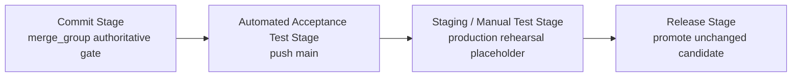

# Pipeline Stages (Farley Stage Model)

This document defines the canonical stage model for `pipeline/stages`.

## Why this exists

The deployment pipeline answers one question with evidence:

Can we safely release this exact candidate now?

We do that by:

1. creating a release candidate once in Commit Stage;
2. promoting that same candidate unchanged through later stages;
3. rejecting candidates as early as possible when evidence says "not fit".

## Core Principles (Non-Negotiable)

1. Build once, promote unchanged.
2. Fast feedback first.
3. Each stage has a clear purpose and pass/fail signal.
4. Failed candidates do not progress.
5. Release and rollback use the same automated mechanism.

## Intake vs Stages

PR open, auto-merge enablement, and merge-queue eligibility are intake/orchestration concerns.
They are not pipeline stages.

## Stage Order

1. `Commit Stage`
2. `Automated Acceptance Test Stage`
3. `Staging / Manual Test Stage` (current implementation: production rehearsal placeholder)
4. `Release Stage`

## Stage Contracts

### Commit Stage (Authoritative Candidate Creation)

Purpose:

- Eliminate unfit changes quickly.
- Create the authoritative release candidate.

Must do:

1. Run fast commit checks.
2. Build deployable artifacts exactly once.
3. Publish immutable digest references.
4. Generate and validate the release-candidate manifest.
5. Publish the candidate by `candidateId=sha-<source-sha-40>`.

Must not do:

1. Long-running end-to-end suites.
2. Manual checks.
3. Rebuild later to repair downstream failures.

Exit:

- Pass: candidate is eligible to merge and progress.
- Fail: candidate is rejected and does not merge.

### Automated Acceptance Test Stage

Purpose:

- Prove customer-visible behavior for the exact merged candidate.
- Prove deployment works using the published manifest (no rebuild).

Must do:

1. Fetch and validate the candidate manifest by `candidateId`.
2. Verify `manifest.source.revision == push SHA`.
3. Deploy exact digest-pinned artifacts from that manifest.
4. Run automated acceptance suites.
5. Record acceptance evidence per `candidateId` + `sourceRevision`.

Must not do:

1. Rebuild artifacts.
2. Substitute different versions.
3. Treat acceptance failure as warning-only.

Exit:

- Pass: candidate can progress to Staging / Manual Test Stage.
- Fail: candidate is non-promotable.

### Staging / Manual Test Stage (Current: Production Rehearsal Placeholder)

Purpose:

- Provide an integrity/evidence gate between acceptance and release.

Rules:

1. Consume only candidates that passed Automated Acceptance Test Stage.
2. Verify candidate and evidence identity integrity.
3. Record production-rehearsal evidence (placeholder semantics today).

### Release Stage

Purpose:

- Promote a previously accepted candidate to production without rebuilding.

Must do:

1. Verify candidate contract.
2. Verify acceptance evidence pass.
3. Verify staging/manual test (rehearsal) evidence pass.
4. Deploy/promote from manifest.
5. Run production smoke verification.
6. Record release evidence.

## Promotion Invariants

1. Candidate identity is `candidateId` + digest-pinned artifacts + source revision.
2. Environment config may vary; candidate artifacts may not.
3. Stage evidence is separate from candidate manifest.
4. Any material artifact change creates a new candidate.

## Stage Boundary

Authoritative candidate creation starts in `Commit Stage` on merge-group integrated candidates.
Everything after that is promotion and evidence collection.
