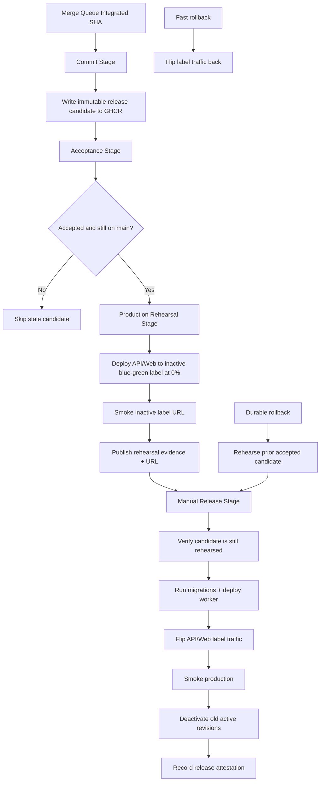

# Pipeline Stages (Farley 4-Stage Model)

This document defines the canonical stage model for `pipeline/stages`.

## Required Flow

1. One immutable candidate identity per integrated SHA.
2. One authoritative Commit Stage build that writes that candidate to GHCR.
3. One acceptance verdict bound to that exact candidate.
4. One production rehearsal of that same candidate at `0%` traffic.
5. One manual production promotion of that same rehearsed candidate.
6. One rollback path to a previously accepted candidate.
7. Commit Stage runs once per candidate.
8. Acceptance runs via `workflow_run` from successful Commit Stage.
9. Production rehearsal runs via `workflow_run` from successful Acceptance Stage.
10. Production release runs via manual `workflow_dispatch` with GitHub environment approval.

## Canonical Flow

## What We Actually Need

The pipeline needs to prove one thing: the exact integrated candidate can be rehearsed unchanged, then promoted unchanged, then rolled back quickly if needed.

## Hardening Baseline

1. `.github/workflows` orchestration actions are pinned to full SHAs and maintained via Dependabot.
2. Privileged downstream stages do not use `pnpm` cache by default.
3. Production deployments are constrained to `main` via GitHub environment branch policy.
4. Release approval lives in GitHub Environments, not a bespoke control plane.

## Stage Contracts

### Commit Stage

Purpose:
- Build and publish one authoritative candidate for one integrated SHA.

Must do:
1. Run authoritatively on `merge_group` only.
2. Execute fast commit checks.
3. Build and push immutable digest-pinned runtime artifacts.
4. Publish one canonical manifest package in GHCR.
5. Attach build provenance/SBOM attestations.

### Acceptance Stage

Purpose:
- Prove that the exact candidate from Commit Stage behaves correctly in non-prod.

Must do:
1. Trigger from successful Commit Stage via `workflow_run`.
2. Resolve candidate identity from GHCR.
3. Guard against stale candidates by requiring SHA presence on `main`.
4. Deploy exact candidate digests from GHCR.
5. Run automated acceptance suites.
6. Attach acceptance attestation to the candidate subject.

### Production Rehearsal Stage

Purpose:
- Deploy the exact accepted candidate to the inactive production label at `0%` traffic and prove it via real URLs.

Must do:
1. Trigger automatically from successful Acceptance Stage.
2. Also support manual `workflow_dispatch` by `candidate_id`.
3. Verify acceptance attestation before mutating production.
4. Resolve active and inactive blue/green labels.
5. Deploy only API and Web to the inactive label at `0%` traffic.
6. Smoke the inactive label URLs and Entra redirect behavior.
7. Publish rehearsal evidence and the rehearsal URL.
8. Supersede any older unreleased rehearsal for the inactive label.

### Release Stage

Purpose:
- Manually promote the exact rehearsed candidate to production.

Must do:
1. Trigger only by manual `workflow_dispatch` with `candidate_id`.
2. Use the GitHub `production` environment as the approval boundary.
3. Verify acceptance attestation again.
4. Verify the requested candidate is still the one rehearsed on the inactive label.
5. Rerun inactive-slot smoke before production mutation.
6. Run migrations.
7. Deploy worker.
8. Flip API/Web label traffic.
9. Smoke production URLs.
10. Deactivate old active revisions and leave only blue/green active.
11. Record release attestation.

## Promotion Invariants

1. Candidate identity is immutable and digest-based.
2. Acceptance evidence and release evidence are bound to the same candidate subject.
3. Production rehearsal and production release never rebuild artifacts.
4. Fast rollback is a traffic flip, not a rebuild.
5. Durable rollback is a re-rehearsal and re-promotion of a previously accepted candidate.

## Promotion Policy Boundary

1. The hard promotion gate is the acceptance attestation (`verdict=pass`).
2. The human approval gate is the GitHub `production` environment.
3. Rehearsal evidence is operational evidence, not a registry attestation.
