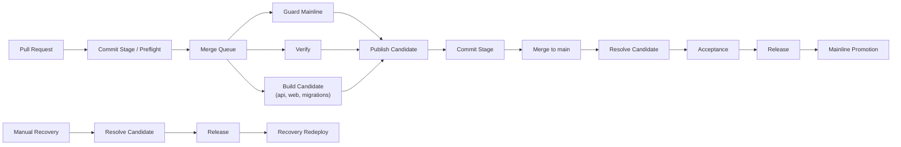

# Pipeline

Compass uses two workflows:

- `10-commit-stage.yml`
- `20-mainline-promotion.yml`

The design goal is simple:

- one required check name: `Commit Stage`
- one authoritative candidate publication point: `merge_group`
- one post-merge promotion path: `push` to `main`

## Workflow Topology

### Commit Stage

`10-commit-stage.yml` runs in two modes:

- `pull_request`: cheap preflight only
- `merge_group`: the full authoritative commit stage

PR preflight keeps the queue fast. It applies labels, lints workflows, validates Bicep, and audits retired references. It does not build or publish anything.

The `merge_group` path is the real Commit Stage. It:

1. checks that the latest mainline promotion is green
2. runs `pnpm check:commit`
3. runs `pnpm check:pipeline`
4. runs `actionlint`
5. builds and publishes the API, Web, and migrations images
6. publishes the immutable release candidate manifest and release unit

`Commit Stage` is the only required merge-queue check.

### Mainline Promotion

`20-mainline-promotion.yml` runs in two modes:

- `push` to `main`: resolve candidate, run Acceptance, run Release
- `workflow_dispatch`: recover by redeploying a previously published candidate

This keeps the Farley-style stage model intact:

1. `Commit Stage`
2. `Acceptance`
3. `Release`

The candidate is built once in Commit and promoted without rebuilds.

## Candidate Model

A release candidate is:

- identified by `sha-<40-character-merge-queue-sha>`
- immutable after Commit publication
- the single artifact consumed by Acceptance and Release

Later stages do not rebuild images or substitute different digests.

## Rules

- Merge queue group size is `1`.
- Merge queue build concurrency starts at `2`.
- `Commit Stage` is the only required status check.
- Deployments are not required before merging.
- Recovery redeploy is for previously published candidates only.
- Recovery skips infrastructure apply and migrations.

## Operating Guidance

- Treat `main` as blocked if `Mainline Promotion` fails.
- Prefer fix-forward over manual recovery.
- Keep PR-time work cheap and integrated-code verification authoritative.
- Keep delivery policy in `platform/pipeline` and repo/ruleset state in `bootstrap/config`.
