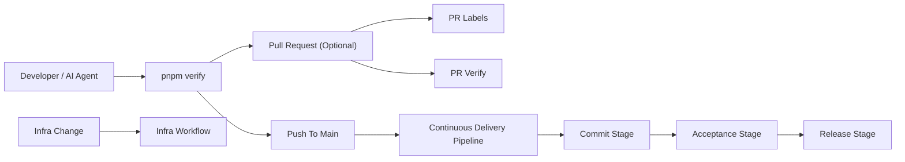

# Continuous Delivery Pipeline

Compass uses four focused workflows:

- `05-pr-labels.yml`
- `10-pr-verify.yml`
- `20-continuous-delivery-pipeline.yml`
- `40-infra.yml`

The design goal is simple:

- one production-shaped path
- one required PR check name: `Verify`
- one authoritative candidate publication point: `push` to `main`
- one build of the release unit
- one candidate promoted without rebuilds

## Workflow topology

### PR Verify

`05-pr-labels.yml` applies PR metadata only.

`10-pr-verify.yml` runs on `pull_request`. It:

1. checks that the branch is rebased onto `main`
2. runs the canonical local Commit Stage, `pnpm verify`

PRs are optional and lightweight. They are a collaboration tool, not the authoritative integration mechanism.

### Continuous Delivery Pipeline

`20-continuous-delivery-pipeline.yml` runs on `push` to `main` and owns the full stage model.

The `push` to `main` path is the real delivery pipeline. It:

1. runs Commit Stage unit tests and integration tests in parallel
2. builds and pushes the API and Web images in parallel
3. runs candidate smoke against the built digests
4. publishes the immutable release candidate manifest and release unit
5. runs black-box API and Web acceptance against that exact candidate
6. verifies the accepted candidate and deploys it through stage and production
7. publishes release evidence and release attestation

## Candidate model

A release candidate is:

- identified by `sha-<40-character-main-sha>`
- immutable after Commit Stage publication
- the single artifact consumed by Acceptance Stage and Release Stage

Later stages do not rebuild images or substitute different digests.

## Rules

- `main` stays linear
- PRs merge by squash only
- PRs are optional
- `Verify` is the only required PR status check
- direct pushes to `main` are allowed by judgment
- the direct path relies on trust, the blocking `pre-push` hook, and fast CDP feedback
- infra validation and apply run in `40-infra.yml`, not in the app delivery path

## Operating guidance

- keep branches short-lived and rebase onto `origin/main` before integration
- use `pnpm verify` as the canonical pre-integration local gate
- use `pnpm acceptance` when you need black-box local acceptance against the candidate
- keep local, PR, and mainline verification on the same repo-owned stage scripts
- treat the line as unhealthy if Acceptance Stage or Release Stage fails for the promoted candidate
- treat red `main` as a line-stop until fixed forward
