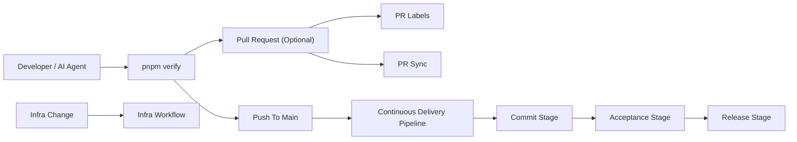
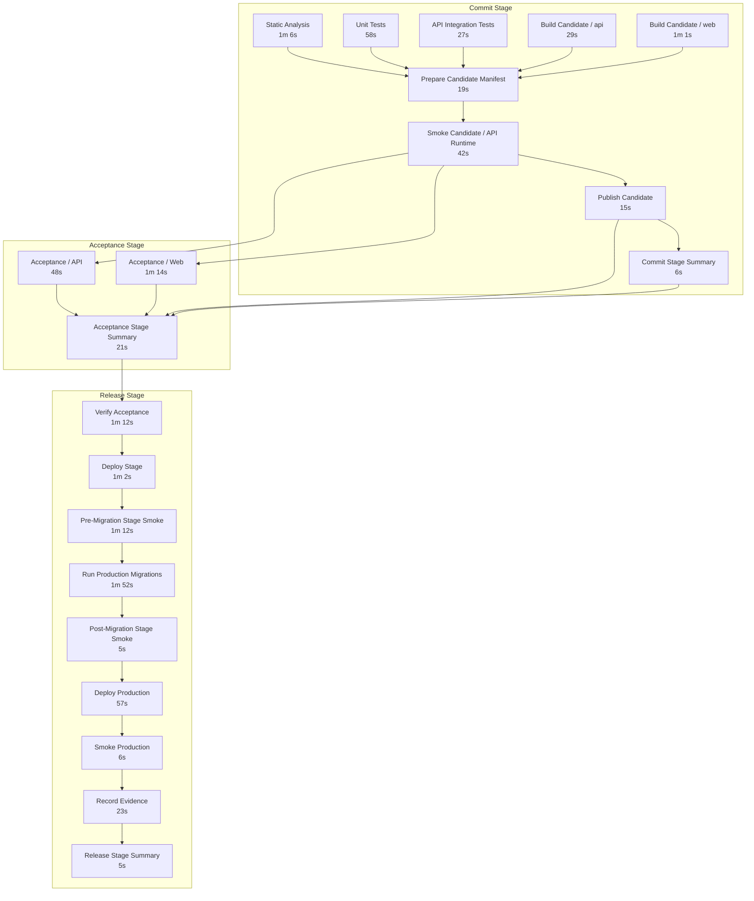

# Continuous Delivery Pipeline

Compass uses four focused workflows:

- `05-pr-labels.yml`
- `10-pr-sync.yml`
- `20-continuous-delivery-pipeline.yml`
- `40-infra.yml`

The design goal is simple:

- one production-shaped path
- one required PR check name: `In Sync`
- one authoritative candidate publication point: `push` to `main`
- one build of the release unit
- one candidate promoted without rebuilds
- one set of explicit time budgets for the whole pipeline
- one canonical live-config model: GitHub repository variables for non-secret sensitive values, Azure Key Vault for runtime secrets, GitHub environments for protection only

## Current CDP shape

Latest green reference run: [22914274341](https://github.com/glcsolutions-ca/compass/actions/runs/22914274341)

## Workflow topology

### PR Sync

`05-pr-labels.yml` applies PR metadata only.

`10-pr-sync.yml` runs on `pull_request`. It:

1. checks that the branch is rebased onto `main`

PRs are optional and lightweight. They are a collaboration tool, not the authoritative integration mechanism.

### Continuous Delivery Pipeline

`20-continuous-delivery-pipeline.yml` runs on `push` to `main` and owns the full stage model.

The `push` to `main` path is the real delivery pipeline. It:

1. runs Commit Stage static analysis, unit tests, and integration tests in parallel
2. builds and pushes the API and Web images in parallel
3. generates the canonical release candidate manifest once from those image digests
4. runs candidate smoke against that exact manifest
5. publishes the immutable release candidate manifest and release unit
6. runs black-box API and Web acceptance against that exact candidate
7. verifies the accepted candidate and deploys it through stage and production
8. publishes release evidence and release attestation

## Candidate model

A release candidate is:

- identified by `sha-<40-character-main-sha>`
- immutable after Commit Stage publication
- the single artifact consumed by Acceptance Stage and Release Stage

Later stages do not rebuild images or substitute different digests.

The same manifest contract is used:

- locally by `pnpm verify` and `pnpm acceptance`
- in GitHub Actions during Commit Stage smoke
- in Acceptance Stage
- in Release Stage

## Rules

- `main` stays linear
- PRs merge by squash only
- PRs are optional
- `In Sync` is the only required PR status check
- direct pushes to `main` are allowed by judgment
- the direct path relies on trust, the blocking `pre-push` hook, and fast CDP feedback
- infra validation and apply run in `40-infra.yml`, not in the app delivery path

## Operating guidance

- keep branches short-lived and rebase onto `origin/main` before integration
- use `pnpm verify` as the canonical pre-integration local gate
- use `pnpm acceptance` when you need black-box local acceptance against the candidate
- keep PR checks minimal and keep full validation on the same repo-owned stage scripts used locally and on `main`
- treat the line as unhealthy if Acceptance Stage or Release Stage fails for the promoted candidate
- treat red `main` as a line-stop until fixed forward
- let Commit and Acceptance for newer commits run immediately while stage and production mutations remain serialized

## Time budgets

The CDP uses explicit target budgets:

- Commit Stage: 5 minutes
- Acceptance Stage: 5 minutes
- Release Stage: 10 minutes
- Total lead time: 15 minutes

These are not decorative numbers. Stage summaries report the actual duration against the target, and
budget breaches are treated as pipeline defects to fix before they become the new normal.
