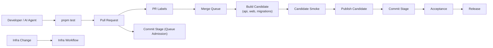

# Pipeline

Compass uses five focused workflows:

- `05-pr-labels.yml`
- `10-commit-stage.yml`
- `20-acceptance.yml`
- `30-release.yml`
- `40-infra.yml`

The design goal is simple:

- one required check name: `Commit Stage`
- one authoritative candidate publication point: `merge_group`
- one build of the release unit

## Workflow Topology

### Commit Stage

`05-pr-labels.yml` applies PR metadata only.

`10-commit-stage.yml` runs a no-op `Commit Stage` queue-admission job on `pull_request` and the authoritative commit stage on `merge_group`.

The `merge_group` path is the real Commit Stage. It:

1. builds and pushes the API, Web, and migrations images
2. runs a fast candidate smoke against those published digests
3. publishes the immutable release candidate manifest and release unit

`Commit Stage` is the only required merge-queue check.

### Acceptance

`20-acceptance.yml` is triggered by successful `Commit Stage` completion for the merge-queue SHA. It:

1. resolves the candidate from GHCR
2. runs system and browser acceptance against the exact candidate
3. publishes the acceptance attestation

### Release

`30-release.yml` is triggered by successful `Acceptance` completion. It:

1. resolves the exact accepted candidate
2. verifies the acceptance attestation
3. deploys the same digests through stage and prod
4. publishes release evidence and release attestation

This keeps the Farley-style stage model intact:

1. `Commit Stage`
2. `Acceptance`
3. `Release`

The candidate is built once in Commit and promoted without rebuilds.

## Candidate Model

A release candidate is:

- identified by `sha-<40-character-merge-queue-sha>`
- immutable after Commit publication
- the single artifact consumed by Acceptance and Release

Later stages do not rebuild images or substitute different digests.

## Rules

- Merge queue group size is `1`.
- Merge queue build concurrency starts at `2`.
- `Commit Stage` is the only required status check.
- Deployments are not required before merging.
- Infra validation and apply run in `40-infra.yml`, not in the app delivery path.

## Operating Guidance

- Treat the line as unhealthy if Acceptance or Release fails for the promoted candidate.
- Keep PR-time work cheap and integrated-code verification authoritative.
- Keep delivery policy in `platform/pipeline` and repo/ruleset state in `bootstrap/config`.
