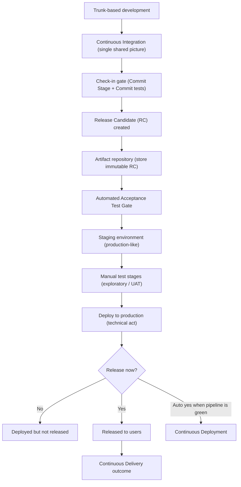

# Dave Farley CD One-Pager (Terminology Baseline)

> **One-liner:** Continuous Delivery is the capability to keep every change releasable and get value to users quickly and safely by validating a single build through a deployment pipeline.

## Vertical Flow (Farley model)

## What Farley is fundamentally saying

- Continuous Delivery is an engineering discipline, not a release calendar.
- The deployment pipeline is a falsification system: every stage tries to disprove release-readiness; only passing builds are promoted.
- CI requires frequent integration on a shared trunk; long-lived feature branches weaken feedback and recreate integration risk.
- The commit stage/check-in gate must be fast and decisive, removing obviously broken changes quickly.
- Build once and promote the same immutable release candidate through later stages; do not rebuild per environment.
- Acceptance tests assert business intent/value, while later manual stages explore usability and residual risk.
- Deploy and release are different decisions: software can be deployed safely before being exposed to users.
- Continuous Deployment is Continuous Delivery with the final release decision automated.

## Canonical Terms For This Repository

Use these terms consistently in folder names, workflow names, docs, code comments, and decision logs.

| Prefer                             | Use it for                                                                             |
| ---------------------------------- | -------------------------------------------------------------------------------------- |
| `Continuous Delivery (CD)`         | Overall capability to keep software always releasable and deliver value quickly/safely |
| `Deployment Pipeline`              | End-to-end validation and promotion path for production-destined changes               |
| `Stage`                            | A promotion step with distinct quality evidence                                        |
| `Commit Stage` / `Check-in gate`   | First fast gate on every check-in                                                      |
| `Commit tests`                     | Fast fail-first test suite for early error detection                                   |
| `Release Candidate (RC)`           | Immutable build/version promoted stage-by-stage                                        |
| `Artifact repository`              | Storage location for immutable RC artifacts                                            |
| `Automated Acceptance Test Gate`   | Gate asserting system behavior against acceptance criteria                             |
| `Staging environment`              | Production-like environment for late-stage confidence                                  |
| `Deploy`                           | Technical rollout to an environment                                                    |
| `Release`                          | Exposure of features/value to users                                                    |
| `Separate deployment from release` | Default operating model for risk control and optionality                               |
| `Continuous Deployment`            | Automatic production release when pipeline is green                                    |

## References (Primary Sources)

- [continuousdelivery.com: What is Continuous Delivery?](https://continuousdelivery.com/)
- [InformIT: What Is a Deployment Pipeline?](https://www.informit.com/articles/article.aspx?p=1621865&seqNum=2)
- [InformIT: The Commit Stage](https://www.informit.com/articles/article.aspx?p=1621865&seqNum=4)
- [InformIT: The Automated Acceptance Test Gate](https://www.informit.com/articles/article.aspx?p=1621865&seqNum=5)
- [Dave Farley: Don’t Feature Branch](https://www.davefarley.net/?p=160)
- [Dave Farley: Continuous Integration and Feature Branching](https://www.davefarley.net/?p=247)
- [Dave Farley: Strategies for effective Acceptance Testing](https://www.davefarley.net/?p=186)
- [Dave Farley: Deploying vs Releasing vs Delivering](https://www.davefarley.net/?p=333)
- [Dave Farley: Continuous Compliance](https://www.davefarley.net/?p=285)
